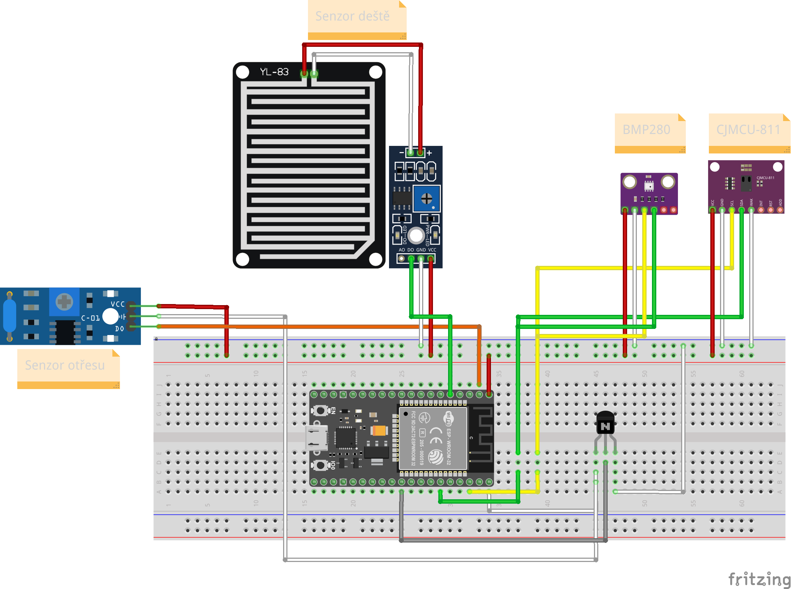

# Obsah
[Limity projektu](#Limity-projektu) 
[Zabezpečení krádeže](#Zabezpečení-krádeže) 
[Zdroje](#Zdroje) 
# Limity projektu
||Teplota|Tlak|CO2|
|--|-----|---|--|
|Maximum|40|110000|8192|
|Minimum|-20|30000|400|
|Značení chyby|45|0|0|

Senzor CO2 potřebuje dle [oficiální dokumentace- kapitola Conditioning Period (Run-In)](https://cdn.sparkfun.com/assets/learn_tutorials/1/4/3/CCS811_Datasheet-DS000459.pdf) k ideální přesnosti 20 min zapnutí. Z důvodů šetření baterie toto není možné (Před čtením ze senzoru uplyne maximálně 60s)

## Označení chyb
Pokud jsou načteny špatné hodnoty (více/méně) než jak je uvedeno Meteostanice odešle data uvedaná v tabulce. Tyto hodnoty se ve výsledném grafu nezobrazí

# Zapojení

Tranzistor: 2n 2222 a331
|ESP32|Název pinu periferie|Zařízení|
|-|-|-|
|GPIO5|base|Tranzistor|
|GPIO21|SDA|BMP280/CJMCU-811|
|GPIO22|SCL|BMP280/CJMCU-811|
|EN|D0|Vibration shock senzor|
|GPIO34|D0|Senzor deště|

# Díly
### ESP32
Levný a energeticky úsporný Tzv. system on chip s Wi-Fi a Bluetooth
### BMP280
Pozor na rozdíl mezi BMP280 a BME280. Zatímco BMP280 měří pouze tlak a teplotu, BME280 měří jak tepotu, tlak, tak i vlhkost.

### CCS811
Označováno také CJMCU-811.
Slouží k snímání hodnot eCO2
### Vibration shock senzor
### Senzor deště

# Zdroje
## Uspání
- [System Time](https://docs.espressif.com/projects/esp-idf/en/latest/esp32/api-reference/system/system_time.html)
- [[C/C++] Converting time structure to date format](https://ubuntuforums.org/archive/index.php/t-1114250.html)

## Senzor deště
- [Rain Sensor Tutorial for Arduino, ESP8266 and ESP32](https://diyi0t.com/rain-sensor-tutorial-for-arduino-and-esp8266/)

## BMP280 senzor
- [ESP32 and BMP280 sensor example](http://www.esp32learning.com/code/esp32-and-bmp280-sensor-example.php)
- [Adafruit BMP280 Driver](https://github.com/adafruit/Adafruit_BMP280_Library)
- [ESP32 with BME280 Sensor using Arduino IDE (Pressure, Temperature, Humidity)](https://randomnerdtutorials.com/esp32-bme280-arduino-ide-pressure-temperature-humidity/)
- [Oficiální dokumentace](https://www.bosch-sensortec.com/products/environmental-sensors/pressure-sensors/pressure-sensors-bmp280-1.html) 
  - a na této stránce nalezený [Data sheet](https://www.bosch-sensortec.com/media/boschsensortec/downloads/datasheets/bst-bmp280-ds001.pdf)

- [Rozdíl mezi BMP280 a BME280](https://randomnerdtutorials.com/dht11-vs-dht22-vs-lm35-vs-ds18b20-vs-bme280-vs-bmp180/)

## BME280 senzor
- [ESP32 with BME280 Sensor using Arduino IDE (Pressure, Temperature, Humidity)](https://randomnerdtutorials.com/esp32-bme280-arduino-ide-pressure-temperature-humidity/)

## CO2 senzor
- [TVOC and CO2 Measurement using Arduino and CCS811 Air Quality Sensor](https://circuitdigest.com/microcontroller-projects/tvoc-co2-measurement-using-aduino-and-ccs811-air-quality-sensor)
- [Oficiální dokumentace](https://cdn.sparkfun.com/assets/learn_tutorials/1/4/3/CCS811_Datasheet-DS000459.pdf)

## Wifi
- [ESP32 HTTP GET and HTTP POST](https://randomnerdtutorials.com/esp32-http-get-post-arduino/#http-post)

## EEPROM
- [ESP32 Flash Memory – Store Permanent Data (Write and Read)](https://randomnerdtutorials.com/esp32-flash-memory/)

## Technika kódu
- [Refaktorování](https://cs.wikipedia.org/wiki/Refaktorov%C3%A1n%C3%AD)

# Mohlo by se hodit
[I2C komunikace](https://randomnerdtutorials.com/esp32-i2c-communication-arduino-ide/)